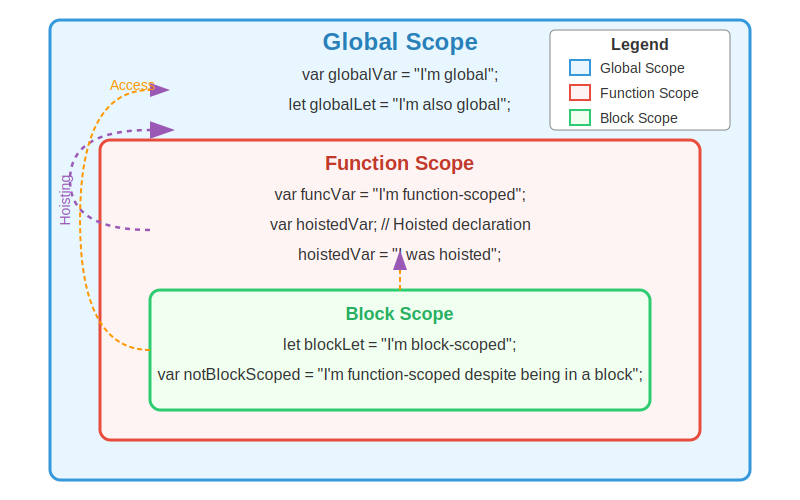

# JavaScript Scope and Hoisting

<!-- ## Presented by: Deepak Sir Inflection ORG Pvt. Ltd. -->

## What is Scope?

**Scope** is a fundamental concept in JavaScript that determines which variables are accessible or "visible" in a particular part of your code.

### JavaScript has three types of scopes:

> ### 🔵 Block Scope
> Variables declared with `let` and `const` inside curly braces `{ }` are only accessible within that block.

> ### 🔴 Function Scope
> Variables declared inside a function are only accessible within that function.

> ### 🟢 Global Scope
> Variables declared outside any block or function are accessible everywhere.

## Visual Representation of Scope

                               ```
                                  +----------------------------------+
                                  |        Global Scope              |
                                  |                                  |
                                  |  var globalVar = "I'm global";   |
                                  |                                  |
                                  |  +----------------------------+  |
                                  |  |     Function Scope         |  |
                                  |  |                            |  |
                                  |  |  var funcVar = "Function"; |  |
                                  |  |                            |  |
                                  |  |  +----------------------+  |  |
                                  |  |  |    Block Scope       |  |  |
                                  |  |  |                      |  |  |
                                  |  |  | let blockVar="Block";|  |  |
                                  |  |  +----------------------+  |  |
                                  |  +----------------------------+  |
                                  +----------------------------------+
                               ```

## What is Hoisting?

**Hoisting** is a JavaScript behavior where variable and function declarations are "lifted" to the top of their containing scope before code execution.

### Hoisting Behaviors:

#### 1️⃣ **var variables**: Declaration is hoisted, initialization is not
```javascript
console.log(x); // undefined (not an error)
var x = 5;
```

#### 2️⃣ **let and const variables**: Hoisted but remain in "Temporal Dead Zone"
```javascript
console.log(y); // ReferenceError
let y = 10;
```

#### 3️⃣ **Function declarations**: Fully hoisted
```javascript
sayHello(); // "Hello!" (works fine)
function sayHello() {
  console.log("Hello!");
}
```

#### 4️⃣ **Function expressions**: Behave like var variables
```javascript
sayHi(); // TypeError
var sayHi = function() {
  console.log("Hi!");
};
```

## 🔗 Scope Chain

The scope chain allows nested functions to access variables from their parent scopes:

```javascript
function outer() {
  let outerVar = "I'm from outer function";
  
  function inner() {
    let innerVar = "I'm from inner function";
    console.log(outerVar); // Accessible via scope chain
  }
  
  inner();
}
```

## 🔍 Scope and Hoisting in Action

```javascript
// Global scope
var globalVar = "I'm global";
let globalLet = "I'm also global";

function exampleFunction() {
  // Function scope
  var funcVar = "I'm function-scoped";
  
  // Hoisting example
  console.log(hoistedVar); // undefined (hoisted declaration)
  var hoistedVar = "I was hoisted";
  
  if (true) {
    // Block scope
    let blockLet = "I'm block-scoped";
    var notBlockScoped = "I'm function-scoped despite being in a block";
    
    console.log(blockLet); // "I'm block-scoped"
    console.log(funcVar);  // "I'm function-scoped"
    console.log(globalVar); // "I'm global"
  }
  
  console.log(notBlockScoped); // "I'm function-scoped despite being in a block"
  console.log(blockLet); // ReferenceError: blockLet is not defined
}
```


## Scope Visual Diagram

<div style="text-align: center">
  
</div>

## 💡 Practice Questions

### Question 1️⃣
**What will be the output of the following code?**
```javascript
console.log(x);
var x = 10;
```
**Answer:** `undefined` (due to hoisting)

### Question 2️⃣
**What will be the output of the following code?**
```javascript
console.log(x);
let x = 10;
```
**Answer:** `ReferenceError` (due to Temporal Dead Zone)

### Question 3️⃣
**What will be the output of the following code?**
```javascript
var x = 10;
function test() {
  console.log(x);
  var x = 20;
}
test();
```
**Answer:** `undefined` (function's local `x` is hoisted but not initialized)

### Question 4️⃣
**What will be the output of the following code?**
```javascript
function foo() {
  return bar();
  function bar() { return "Hello!"; }
}
console.log(foo());
```
**Answer:** `"Hello!"` (function declaration is hoisted)

### Question 5️⃣
**What will be the output of the following code?**
```javascript
for (var i = 0; i < 3; i++) {
  setTimeout(() => console.log(i), 100);
}
```
**Answer:** `3 3 3` (because `var` is function-scoped)

## 📝 Summary

- **Block scope**: Created with `let` and `const` inside `{}` blocks
- **Function scope**: Created for variables declared inside functions with `var`, `let`, or `const`
- **Global scope**: For variables declared outside any function or block
- **Hoisting**: Declarations are moved to the top of their scope
  - `var`: Declaration hoisted, initialized as `undefined`
  - `let`/`const`: Hoisted but not initialized (Temporal Dead Zone)
  - Function declarations: Fully hoisted with their definition
  - Function expressions: Only variable declaration is hoisted.
  <hr style="margin: 40px 0;">
  <!-- ✅ Professional Footer -->
<footer style="text-align: center; padding: 20px; background-color: #2c3e50; color: #ecf0f1; border-radius: 12px;">
  <p style="font-size: 18px;">✨ Thanks for visiting this page! ✨</p>
  <p style="font-size: 14px;">Created with ❤️ by Prabhat Student At, Inflection ORG Pvt. Ltd.</p>
</footer>